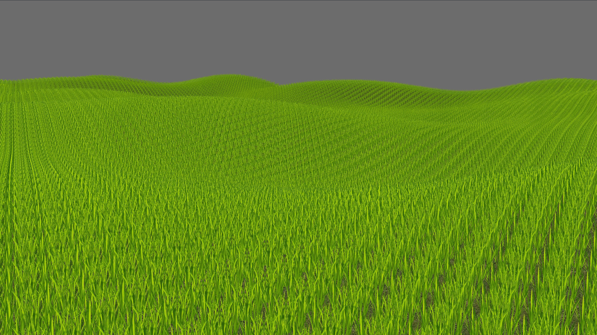

# VkGrass
A basic grass demo

## Installation
Make sure to use the `--recurse-submodules` option when cloning.

Build dependencies:
 - pkg-config
 - some recent version of clang++ (g++ should work, but is not tested)

Compilation dependencies:
 - glm
 - a vulkan driver, and the following pacman packages:
   - vulkan-headers (for compiling)
   - vulkan-validation-layers (for debugging)
   - vulkan-tools (for the very useful vulkaninfo command)

Runtime dependencies:
 - a vulkan-capable driver/card
 - assimp
 - glfw

## Controls
 - `WSAD` to move
 - `Space` to go up
 - `Lshift` to go down
 - `R` to reset the camera

## Improvements
- Render grass
  - get grass to move from wind
  - why do I have to flip UVs for grass?
- Render sun
- Make one large memory alloc and break off chunks of it for buffers
- Use a mesh shader for generating vertices (can do a whole quad at a time!)

Credits:
 - Grass billboard texture: [Reiner “Tiles” Prokein](https://www.reinerstilesets.de/graphics/lizenz/)
 - Skybox texture: [LearnOpenGL](https://learnopengl.com/Advanced-OpenGL/Cubemaps)
 - Everything else: me
